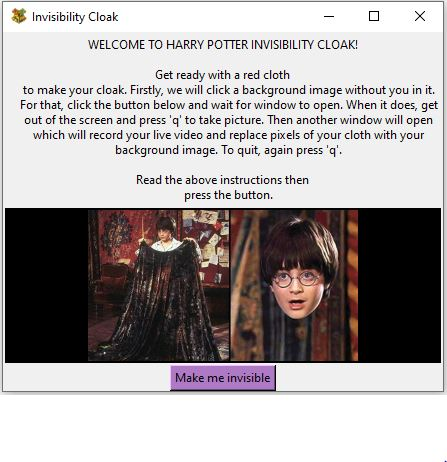
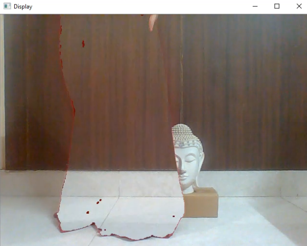

# Invisibility Cloak

Harry Potter Invisibility Cloak implementation using OpenCV. We will first take a picture without the person as the background image. Then we will create a mask defining red pixels and remove them from the current frame.

Instructions window: 

Here is how it looks like:

 